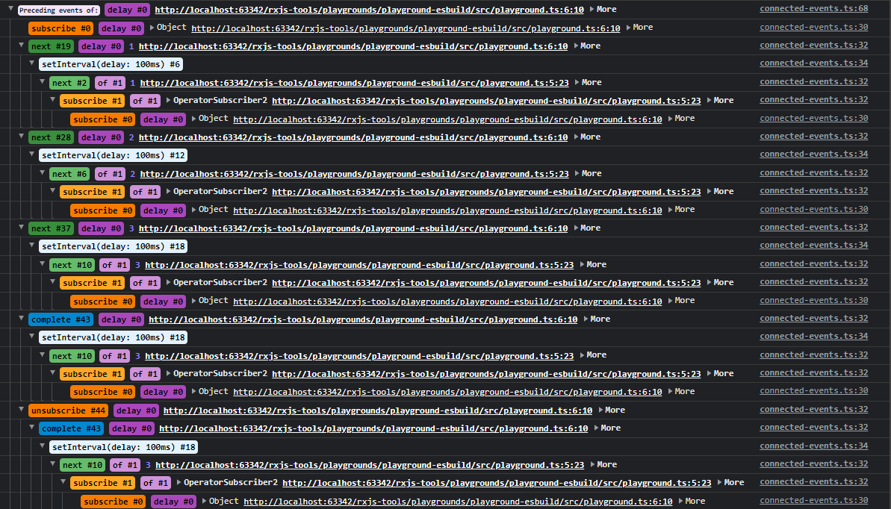
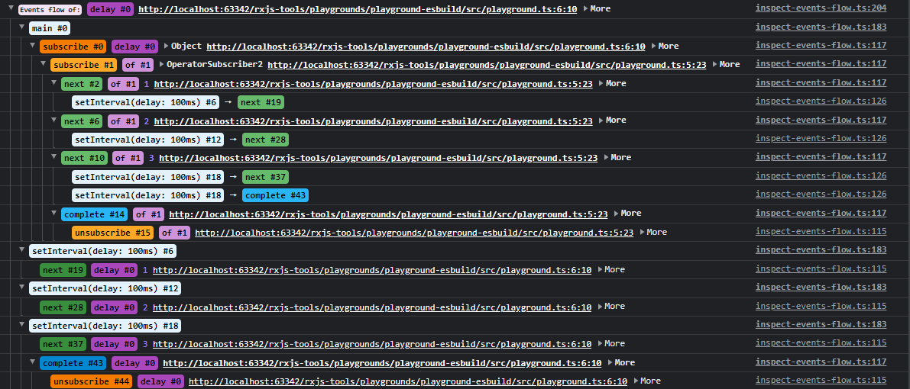

# Console usage

The `@rxjs-insights/console` package exports a few functions that allow to analyze the collected data in the context of the target (`Observable` or `Subscription`).

## Interactive output

The analysis is presented in the form of the browser console output.
Moreover, the output provides somewhat interactive experience allowing for drilling-down to other analysis and/or targets.
This is achieved by the presence of the `More` object at the end of every log line.
The drill-down can be performed by expanding the `More` object and invoking one of the inspection functions, e.g.:


## Inspections

### `inspect(target: Observable | Subscription)`

Shows the detailed info about the target.

```ts
import { delay, of } from 'rxjs';
import { inspect } from '@rxjs-insights/console';

const subscription = of(1, 2, 3)
  .pipe(delay(100))
  .subscribe({
    complete() {
      // wait for the data to be collected
      queueMicrotask(() => inspect(subscription));
    },
  });
```


### `inspectSubscribers(target: Observable | Subscription)`

Shows the subscriber(s) of the target.

```ts
import { delay, of } from 'rxjs';
import { inspectSubscribers } from '@rxjs-insights/console';

const subscription = of(1, 2, 3)
  .pipe(delay(100))
  .subscribe({
    complete() {
      // wait for the data to be collected
      queueMicrotask(() => inspectSubscribers(subscription));
    },
  });
```


### `inspectSources(target: Observable | Subscription)`

Shows the subscriber(s) of the target; for each subscriber shows the source subscriber tree.

```ts
import { delay, of } from 'rxjs';
import { inspectSources } from '@rxjs-insights/console';

const subscription = of(1, 2, 3)
  .pipe(delay(100))
  .subscribe({
    complete() {
      // wait for the data to be collected
      queueMicrotask(() => inspectSources(subscription));
    },
  });
```


### `inspectDestinations(target: Observable | Subscription)`

Shows the subscriber(s) of the target; for each subscriber shows the destination subscriber tree.

```ts
import { delay, of } from 'rxjs';
import { inspectDestinations } from '@rxjs-insights/console';

const subscription = of(1, 2, 3)
  .pipe(delay(100))
  .subscribe({
    complete() {
      // wait for the data to be collected
      queueMicrotask(() => inspectDestinations(subscription));
    },
  });
```


### `inspectEvents(target: Observable | Subscription)`

Shows the events of the target.

```ts
import { delay, of } from 'rxjs';
import { inspectEvents } from '@rxjs-insights/console';

const subscription = of(1, 2, 3)
  .pipe(delay(100))
  .subscribe({
    complete() {
      // wait for the data to be collected
      queueMicrotask(() => inspectEvents(subscription));
    },
  });
```


### `inspectPrecedingEvents(target: Observable | Subscription)`

Shows the events of the target; for each event shows the chain of events that triggered the given event.

```ts
import { delay, of } from 'rxjs';
import { inspectPrecedingEvents } from '@rxjs-insights/console';

const subscription = of(1, 2, 3)
  .pipe(delay(100))
  .subscribe({
    complete() {
      // wait for the data to be collected
      queueMicrotask(() => inspectPrecedingEvents(subscription));
    },
  });
```



### `inspectSucceedingEvents(target: Observable | Subscription)`

Shows the events of the target; for each event shows the tree of events that were triggered by the given event.

```ts
import { delay, of } from 'rxjs';
import { inspectSucceedingEvents } from '@rxjs-insights/console';

const subscription = of(1, 2, 3)
  .pipe(delay(100))
  .subscribe({
    complete() {
      // wait for the data to be collected
      queueMicrotask(() => inspectSucceedingEvents(subscription));
    },
  });
```


### `inspectEventsFlow(target: Observable | Subscription)`

Shows an ordered tree of events related to the target events.

```ts
import { delay, of } from 'rxjs';
import { inspectEventsFlow } from '@rxjs-insights/console';

const subscription = of(1, 2, 3)
  .pipe(delay(100))
  .subscribe({
    complete() {
      // wait for the data to be collected
      queueMicrotask(() => inspectEventsFlow(subscription));
    },
  });
```


